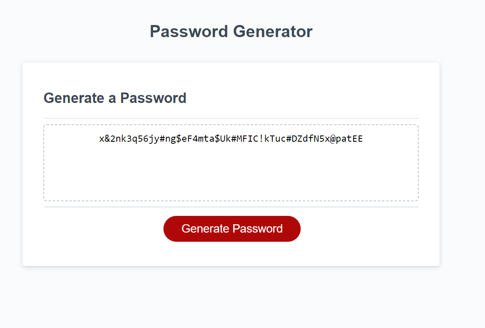

# Password Generator

## Description

This project is a random password generator, intended for use by anyone who has access to any kind of sensitive data and wishes to have a strong password generated for them, providing greater security for themselves and their data. The password is generated following a series of inputs and decisions by the end user. Passwords are between 8 and 128 characters long and can include any or all of the following: upper or lower case letters, numbers, or special characters.

## Installation

No installation is necessary! Follow the following links to the github repository and live site.

Github repository: https://github.com/kurtriecken/Password-generator

Deployed site: https://kurtriecken.github.io/Password-generator/

## Usage

Below is screenshot of the deployed website. 

To begin, click the red button titled "Generate Password" near the bottom of your screen. Follow the prompts and answer the questions as requested by the browser. When prompted for a number of characters for your password, only valid numbers between 8 and 128 will be accepted. Any other inputs will cause an error message and re-prompt for a number.

Selecting 'OK' for a character type will include at least one of that type of character in your generated password. Selecting 'Cancel' will exclude that character type from your password. Repeated characters are possible. 

Once the password is generated, it will be displayed in the box at the center of your screen. You may highlight the password with your mouse to copy and save; or, if you choose, take a screenshot for storage on your device.

If you have any questions or if my site does not function properly on your device, please contact me here on GitHub.

## Credits

HTML and CSS provided by UCF/EdX Web Development bootcamp
Javascript functionality by kurtriecken (github.com/kurtriecken)

## License

MIT license